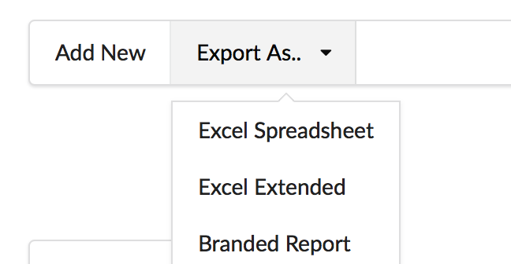

Due to the popular request, here is a add-on for ATK Data and (optionally) ATK UI libraries for performing all sorts of data exports including:

- export data from model as CSV
- export data into raw XLS files
- export data into templated XLS files

The last option allows you to provide your own XLS files with your own branding and formatting and the data will be "inserted" into row region as you specify it.

Optional integration into ATK UI contributes few UI components:

- Grid/CRUD button "Export as .."
- Form with Upload button and progress bar for uploading CSV data

All the above operations will work with database supported by ATK Data and will respect conditions, limit, order. Expression and aggregate fields are also fully supported. To produce summary reports see `atk4/report` add-on.

To install: `composer install atk4/csv`.

## Usage

The most basic usage:

```php
(new \atk4\csv\Export($model))->saveAsCSV('file.csv', ['id', 'name']);
```

If you have `phpoffice/phpspreadsheet` installed, you may also use:

``` php
(new \atk4\csv\Export($model))->saveAsSpreadsheet('file.xlsx', ['id', 'name']);
```

(you may pass 3rd argument to this method - Xls $writer).

Alternatively you may use "downloadAsCSV" adn "downloadAsSpreadsheet" methods - instead of saving into a physical file on the server, they'll send HTTP headers and the file will be downloaded to user's computer. 

### Type and Header support

One great thing about this CSV exporter is that it recognize and support Date, currencies correctly.

Since ATK Data also carry field caption information, titles for your table will be automatically provided.

### Export using template

Class SpreadsheetTemplateExport extends Export by adding support for templates:

``` php
$tpl = new \atk4\csv\SpreadsheetTemplateExport('template.xslt');
$tpl->fillIn('B2', $model, ['id', 'name']);
// fills in B2, C2 columns going down with data from model.
```

This class is slightly different and you start by giving it a branded template file. Then you can call "fillIn()" several times or access spreadsheet by $tpl->spreadesheet if you wish to do any extra tweaks yourself.

fillIn works like this:

1. fills in the initial cells - B2 / C2
2. for next row it advances down. 
3. if B3/C3 already contain some data or formula, it will insert new row above by copying B2/C2. This operation will only copy formatting, not the content.
4. If the B3/C3 row originally had formula in it which included fillable region, the formula's bottom range will be extended to contain the entire area.

The above enables you to include accurate formulas into your spreadsheet.

To save the final file you can use `saveAsSpreadsheet()` method.

## ATK UI integrations

The above exporters can be easily integrated with your UI using some of the ATK UI components:

``` php
$button = $grid->add(new \atk4\csv\View\ExportButton('Export as..'));

$button->addExportOption('Excel Spreadsheet', function() use($grid) {
    $export = new \atk4\csv\Export($grid->model);
    $export->saveAsSpreadsheet('file.xlsx', ['id', 'name']);
});
$button->addExportOption('Excel Excended', function() use($grid) {
    $export = new \atk4\csv\Export($grid->model);
    $export->saveAsSpreadsheet();  
      // all columns!!
      // automatically generates file name!!
});
$button->addExportOption('Branded Report', funciton() use($grid) {
    
    // prepare report
    $group = new \atk4\report\GroupModel($grid->model);
    $group->groupBy(
        ['user_id', 'type'],
        ['total'=>'sum([amount])']
    );
    
	$tpl = new \atk4\csv\SpreadsheetTemplateExport('template.xslt');
	$tpl->fillIn('B2', $group, ['user', 'type', 'total']);
    
    $tpl->saveAsSpreadsheet('summary-report.xlsx');
});
```

The look:



